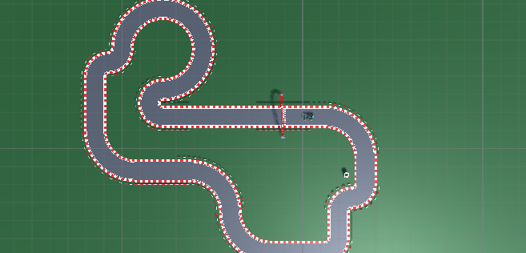
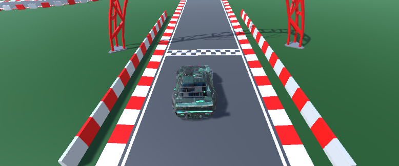
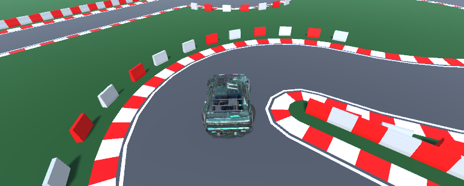
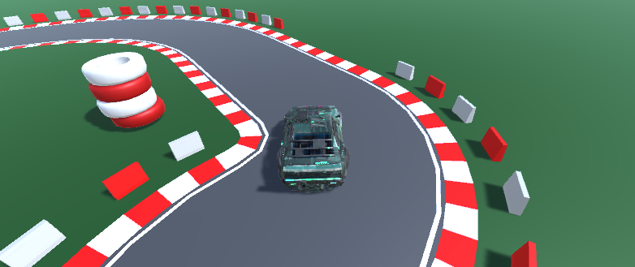

# Jogo de Corrida

[](https://opensource.org/licenses/MIT)
[](https://unity3d.com/get-unity/download/archive)



## Descrição

Este repositório contém um jogo de corrida simples, onde o objetivo é controlar o movimento de um carro. O jogo foi desenvolvido utilizando a Unity e requer alguns ativos do store, incluindo uma [pista](https://assetstore.unity.com/packages/3d/environments/roadways/modular-lowpoly-track-roads-free-205188) e um [carro](https://assetstore.unity.com/packages/3d/vehicles/land/free-sci-fi-car-184607).

### Recursos do Jogo

- Gráficos 3D.
- Controles de carro responsivos.
- Pistas desafiadoras com curvas.

## Gameplay

O movimento do carro é controlado pelo seguinte script:

```csharp
public class movimento : MonoBehaviour  
{ 
    public float speed = 15f; // Aumente esse valor para aumentar a velocidade do carro 
    public float rotationSpeed = 100f; 

    private void Update()
    {
        float moveInput = Input.GetAxis("Vertical");
        float rotateInput = Input.GetAxis("Horizontal");

        // Movimento para frente e para trás
        transform.Translate(Vector3.forward * moveInput * speed * Time.deltaTime);

        // Rotação do carro
        transform.Rotate(Vector3.up * rotateInput * rotationSpeed * Time.deltaTime);
    }
}
```

Para aumentar a velocidade do carro, você pode ajustar o valor da variável `speed`. Da mesma forma, você pode controlar a velocidade de rotação ajustando o valor da variável `rotationSpeed`.

## Requisitos

Antes de começar, certifique-se de ter os seguintes requisitos instalados:

- Unity versão 2022.3.0f1 ou superior

## Instalação

Siga as etapas abaixo para executar o jogo em sua máquina local:

1. Baixe os arquivos do jogo a partir [deste link](https://drive.google.com/drive/folders/1UgtBISJhhGo537nAaBooCTNqZLWwNCIj?usp=sharing).
2. Abra o projeto Unity utilizando a versão especificada nos requisitos.
3. Explore os arquivos do jogo para entender a estrutura e os ativos utilizados.

## Como Jogar

Siga as instruções abaixo para jogar o jogo:

1. Execute o jogo no Unity para começar a jogar.
2. Utilize as teclas de seta ou as teclas WASD para controlar o movimento do carro.
3. Desvie dos obstáculos e tente alcançar a linha de chegada no menor tempo possível.
4. Aproveite a experiência de corrida emocionante!


## Screenshots

Aqui estão algumas capturas da tela do jogo:




```


